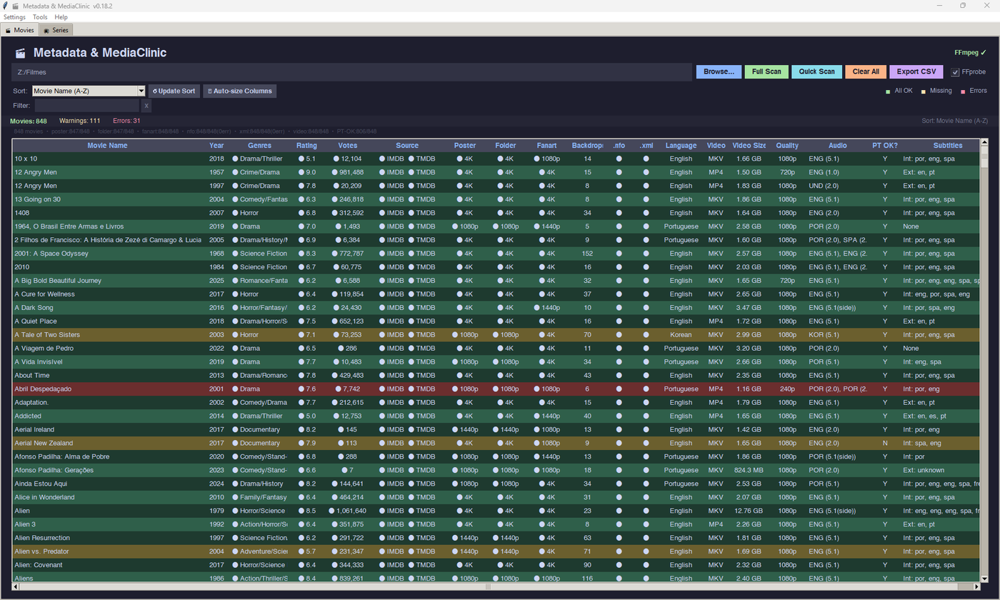
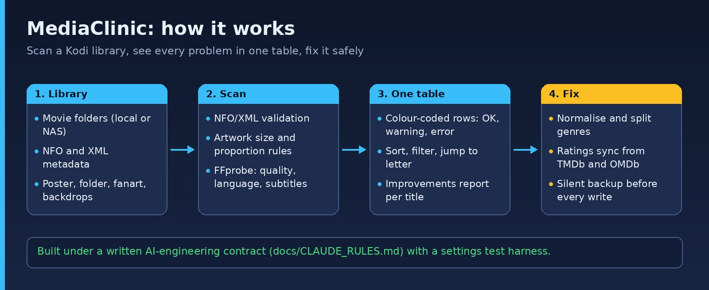

# MediaClinic

**A library health tool for Plex, Kodi, Emby and Jellyfin users: scan your offline movie library, find broken or incomplete metadata and artwork, and fix them.**

[](LICENSE)   [](https://github.com/junqueirach/mediaclinic/actions/workflows/ci.yml)

<p align="center"></p>

**Download for Windows:** get `MediaClinic-0.18.3-win64.zip` (about 18 MB) from the [latest release](https://github.com/junqueirach/mediaclinic/releases/latest). Unzip it, open the `MediaClinic` folder and double-click `MediaClinic.exe`. No Python needed. The SHA-256 checksum is in the release notes.

> **Windows SmartScreen:** the file is not code-signed, so Windows may show "Windows protected your PC". Click **More info**, then **Run anyway**. You can also run the app from source (see Quick start) and read every line of the code first.

## How it works

<p align="center"></p>

MediaClinic expects one subfolder per movie, the layout used by Plex, Kodi, Emby and Jellyfin. It checks Kodi `.nfo` and Emby/Jellyfin `movie.xml` files, so it also suits Plex libraries that use an NFO add-on. It checks every artwork file, metadata file and video, and shows one colour-coded health table, red for errors and yellow for warnings. From the same table you can repair the common problems in place.

## What it checks

| Area | Checks |
|---|---|
| Artwork | `poster.jpg`, `folder.jpg`, `fanart.jpg` present, not corrupt, right proportions, minimum resolution tier (4K to 360p), minimum file size |
| Backdrops | `backdrop.jpg`, `backdrop1.jpg` and so on: count and average size |
| Metadata | `MovieName.nfo` (Kodi) and `movie.xml` (Emby/Jellyfin) present and well-formed, with line-level error reporting |
| Identity | IMDB and TMDB IDs across all NFO/XML tags: missing, empty, conflicting, or present in one file only |
| Ratings, titles, year | Rating and votes, NFO title against XML local title, missing year |
| Genres | Non-standard genres, synonyms, merged tags such as `Family/Fantasy`, translations from eight languages |
| Video (FFprobe) | Resolution class, audio tracks and languages, embedded subtitles, required language |

Every check is a **health rule** you can switch on or off, or tune, in *Settings → Health Rules*.

## What it fixes

- **Normalize Genres** and **Normalize Sources**: written to both NFO and XML
- **Sync Ratings** from TMDb and OMDb (you supply your own free API keys)
- **Fetch Poster, Fanart and Backdrops** from TMDB with thumbnails, or **extract backdrop frames** from the video with FFmpeg
- **Export Movie List** to CSV, text or Excel, with column presets and the option to export only the filtered view
- **Safe edits**: every NFO/XML is backed up silently before it is written, with automatic backup folder maintenance
- Keyboard shortcuts, jump-to-letter, sortable columns, a Quick Scan that re-reads only what changed, rotating logs

## Quick start

From the Windows download, just run `MediaClinic.exe`. From source:

```
pip install -r requirements.txt     # optional: pillow, openpyxl
python mediaclinic.py
```

Run it from the folder that contains the `settings_*.py` files. FFmpeg and FFprobe are optional but recommended (point *Settings → Tools* to their `bin` folder). Settings, your API keys and the last scan are stored in `%APPDATA%\MediaMetadataClinic\`, outside this repository; `logs/` and `backup/` are created next to the program. See [docs/help](docs/help) for the in-app help pages.

## Engineering notes

This project is the clearest example of working with an AI under a written contract:

- [`docs/CLAUDE_RULES.md`](docs/CLAUDE_RULES.md) defines module boundaries, the save chain, naming rules and a safety checklist that every AI-edited change must respect
- `settings_schema.json` plus `tests/settings_test_harness.py` check the settings subsystem after every change
- `tests/selftest_v0_18_3.py` builds a synthetic library (NFO, XML, generated JPEGs and a real 3-second MKV) and runs 98 end-to-end checks, from health rules to the export dialogs; it runs in CI under a virtual display and never touches your real settings
- The code is split into model, controller, context, dialog, export, help and genre-data modules so the AI can edit one part without breaking another
- About 14,500 lines of Python in eight modules; 30 earlier versions in `archive/versions/`, starting from a 12 KB folder scanner
- Changes per version are in [CHANGELOG.md](CHANGELOG.md)

---

## How this was built

Built with **Claude (Anthropic)** as the coding partner. I wrote the requirements and the revision prompts, tested every build on real data, and decided what to fix next. The `archive/versions/` folder keeps every earlier release so the iteration history is visible.

**Security note:** the app stores any API keys you enter in a local settings file outside this repository. `.gitignore` excludes config and settings files so keys are never committed.

## Contributing and security

See [CONTRIBUTING.md](CONTRIBUTING.md) and [SECURITY.md](SECURITY.md). Bug reports and ideas are welcome through the issue templates.

## Licence

MIT. See [LICENSE](LICENSE). This product uses the TMDB API but is not endorsed or certified by TMDB. OMDb data is subject to the [OMDb API terms](https://www.omdbapi.com/legal.htm). FFmpeg is a separate download under its own license.

## Author

Luiz Junqueira - [junqueira.ch](https://www.junqueira.ch) - [LinkedIn](https://www.linkedin.com/in/luizjunqueira/)
